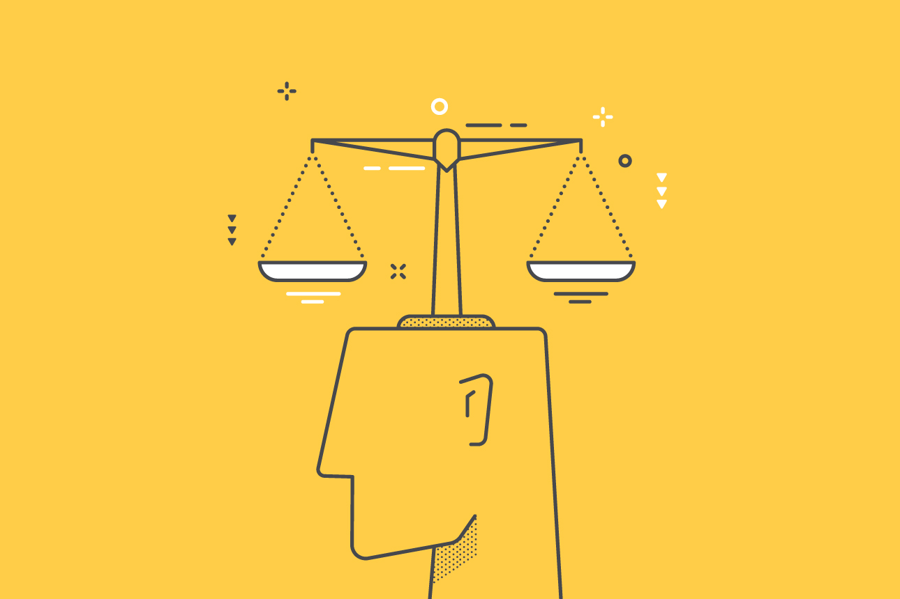

For the past few months, I have been learning the ins and outs of software engineering through my software engineering class. Honestly, it has been a journey, and I wanted to share my experience going through it all. While becoming a software engineer was something that I was initially undecided on, after taking that class, I am confident in both my skills and interest in the field going forward.

## The Stack

&nbsp;&nbsp;&nbsp;&nbsp;&nbsp;&nbsp; The software engineering class that I took was focused on full stack development. This meant learning about technologies like JavaScript, HTML, CSS, React, MongoDB, and a bunch of other useful frameworks. This was definitely not easy to do as my computer science classes before were primarily focused on a singular language, like C or Java, whereas here you have to learn the entire stack. However, despite these technologies being very prominent and used by millions of people, I feel that learning these technologies was not the most important thing that I learned in this class.

## The Process

&nbsp;&nbsp;&nbsp;&nbsp;&nbsp;&nbsp; Instead, I have found the lessons about the processes of software engineering to be the most insightful. After all, the most important part about hiring a software engineer is the person, not the languages/frameworks they know. The hottest new languages and frameworks always change, but learning about the processes of software engineering is something that is always going to be relevant. Some highlights include learning about agile project management. Agile project management has a very high emphasis on delivering results swiftly, and it is done by setting concrete milestones that require something is deliverable at the end of the milestone, which can be periods of 7-14 days. This is done with fairly frequent meetings to determine progress and figure out which issues to prioritize. Then each team member will choose their own issues to focus on and attempt to complete before the milestone. This allows the most important issues to be addressed, and allows the team to adapt easily to new issues and address them appropriately, or in other words, be agile! Learning about this was super insightful as it taught me how software teams are able to deliver products so fast.
  
## Being Ethical

&nbsp;&nbsp;&nbsp;&nbsp;&nbsp;&nbsp; Closing up the semester, we learned about one of the most important aspects of being a software engineer, ethics. Ethics is something that is not always thought of when thinking about writing a program, but is getting more and more relevant as technology evolves. Ethics can be clear in high visibility professions like doctors and civil engineers, where anything they do has a clear visible effect on others, when you are just following orders to write code on a computer screen, it can be hard to tell whether your actions are ethical. One example of this that is [The code I'm still ashamed of](https://www.freecodecamp.org/news/the-code-im-still-ashamed-of-e4c021dff55e/#.tsjl7lkxy), which tells a simple story of Bill, software engineer that made a website for a client. However this website was advertising a drug with severe side effects, and those side effects led to depression and self harm in many patients. While Bill isn't responsible for the side effects of this drug, and was just following his client's orders, his software helped the pharmaceutical company sell that drug and is considered unethical. These type of stories will only get more common as software gets more involved in our lives, controlling our advertisements, and driving our cars. To ensure that we can practice software engineering while being a positive influence to society, we were taught a few code of ethics, one of which being the [Software Engineering Code of Ethics and Professional Practice](https://www.computer.org/education/code-of-ethics). As someone who aspires to be a software engineer while maintaining my personal integrity, this code of ethics is something that I'll always keep in mind.
