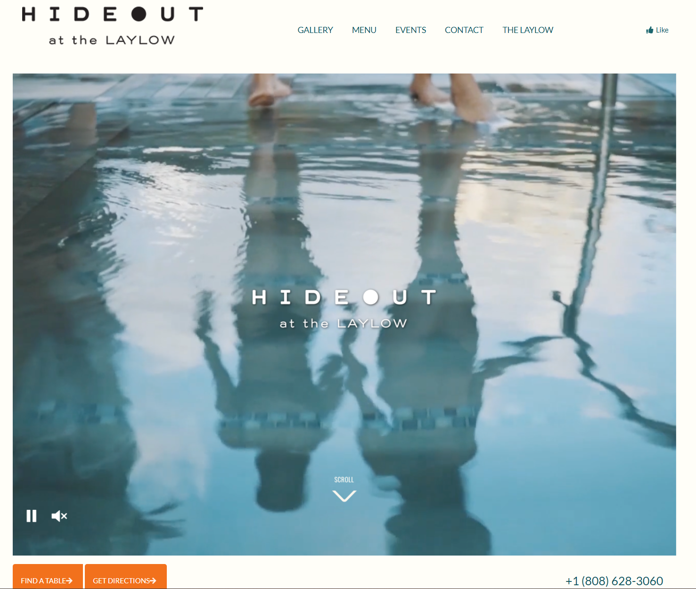

This week I have been lucky enough to learn about web design in my software engineering class. Last week we learned about HTML/CSS, and as someone who has only learned more backend technologies such as Java or Python, learning the technologies that make up the websites I use everyday has been very eye opening. Now we are learning about UI frameworks, with exercises in Semantic finishing up this week, and a React module coming in the next.
<br>

## UI Frameworks
After doing some work in HTML and CSS, I definitely feel like learning at least one UI framework is worth the time. Raw HTML and CSS will let you create anything you need for a website, but using a UI framework simplifies it immensely, which eventually makes the time invested in learning one worth it. One example of this is how much easier it becomes to create a navigation bar. With raw HTML and CSS, you have to create your own ```div``` class and figure out all the extra features you want. However with a framework like Semantic, you can just specify the specific type of navigation bar that you want, and it will have its own class that will do most of the work for you. For example, for an assignment I needed a black navigation bar on the top that is fixed and has four items, and all I needed to do when using Semantic was make a ```div``` with ```"ui fixed top inverted four item menu"``` as its class, and I got exactly what I wanted. Meanwhile, a similar navigation bar that I had to create for a seperate assignment was both harder to program, and a lot less visually appealing.

## Semantic
The UI framework that I learned first was Semantic. Semantic makes it much easier to create a good looking website very quickly. The image of the website at the top of this essay is actually a copy of another website that I was able to create in under 30 minutes. I can say without a doubt that I would've taken much longer had I used only raw HTML and CSS. To duplicate the result that I got with Semantic, I would've needed to spend much longer messing around with margins and padding to get everything in the proper place, whereas with Semantic I just needed to use its ui menu classes. This simplicity is why I believe that even if you have good HTML and CSS skills, I still believe that it's worthwhile to learn a UI framework like Semantic.
