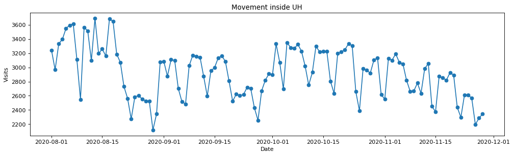

  

  When I was working as a research assistant under Professor Monique, she was researching the spread of COVID-19 in Hawaii. One of the things she was curious about was whether there was a correlation for the number of COVID-19 cases and the amount of people that visited/passed through a certain zip code that particular day. 
  
  To do this, I was given access to some SafeGraph datasets where they collected anonomyous data on where people have visited based on location pings from their cell phone. The one that I used the most was the social distancing metrics dataset (see documentation here https://docs.safegraph.com/docs/social-distancing-metrics).I ran into a lot of problems during this project, which has taught me a lot. One problem was that the datasets from SafeGraph are extremely large, as they contain many categories of data for all 50 US states, whereas I only needed some specific data for Hawaii. Therefore I had to learn how to use the pandas library in Python to process all of it, and use the pickle library to save storage and load the data faster. Also since the dataset records locations as census block groups and I needed data about zip codes, I had to learn about what constitutes a census block group, find a spreadsheet that lists the census block groups in a zip code, and then write a function to convert between the two.
  
Source code at https://github.com/hovictor2000/zipcode-mobility-data

