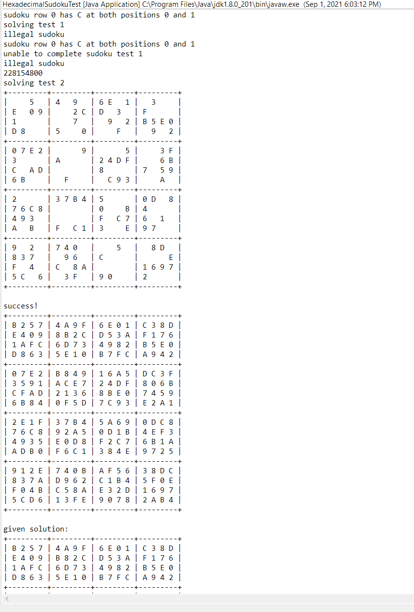

  

  One of the assignments I was assigned while learning recursion was to make a sudoku solver. The code to make the board and check the final result was provided, so I needed to create the functions required to solve the sudoku board. To do this, I made two functions, one for checking the legal values of a given tile in a sudoku boad, and another to solve the board using recursion. The algorithm I chose was backtracking, having the program try a legal value and then try to solve the rest of the board, and if an error occurs, then it'll backtrack until it can try a different value. 
  This assignment was very tough for me at the time, as recursion was something that was still very new to me, and it was hard to wrap my head around it. My initial solution was very slow, as the function I used to check legal values would check the entire board, which as you can guess is very slow as to check the entire board, you have to check every single tile inside it. For an n x n sudoku board, this meant that it would run O(n^2) times everytime the function was called, and the function needed to be called everytime at least once for every empty tile in the sudoku board to solve. Therefore my first implementation took over an hour to solve a hard sudoku board. I fixed it so that it'll only check the same row and 4x4 section it's in, which lowers the runtime to O(n), and as a result, it only took around 10 minutes to solve the board that took my first implementation one hour. This served as a nice lesson on how fast runtime can grow for inefficient algorithms.
  
Source code at [https://github.com/hovictor2000/sudoku-solver](https://github.com/hovictor2000/sudoku-solver).

