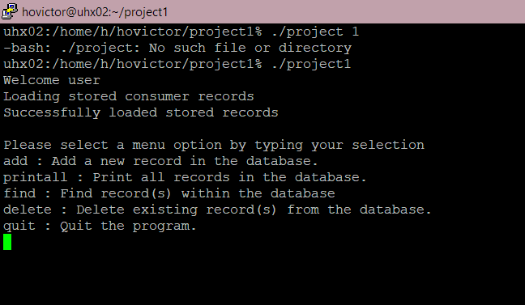

  

  The biggest assignment in my Program Structure class was making an entire consumer records database app inside a CLI using C. Coming from using Java and Eclipse in my previous computer science class, writing C code with vim inside a command shell was a completely different experience. Aside from not having the conveniences of an IDE, writing C code and using pointers was very hard, but also super interesting. TO DO.
  
Source code at [https://github.com/hovictor2000/consumer-records-database](https://github.com/hovictor2000/consumer-records-database).

