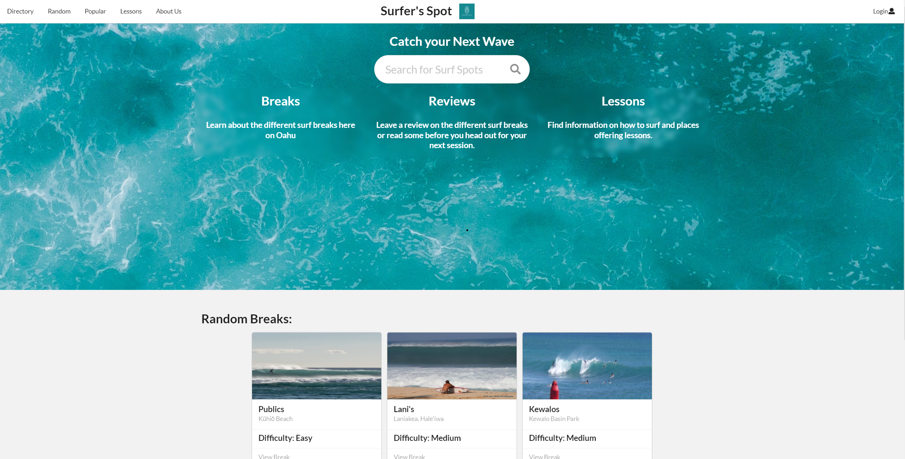
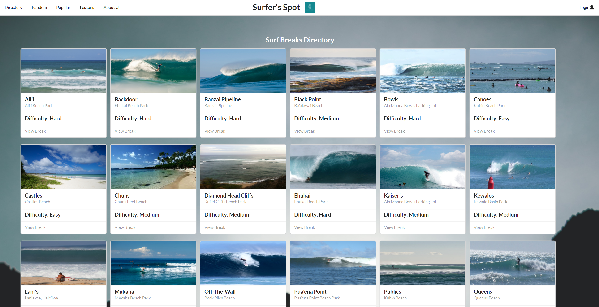

## Overview

  

As the final project for my software engineering class, we were tasked with creating a web application with a team made up of other classmates. We decided to create a web application for finding surf breaks in Hawaii, as it can be hard to find out where all the surfing spots are when you are new to the island. The website we created supported a directory of surf breaks, each with an image, type, location, difficulty, description, and an option to leave reviews. In addition, we had a page for new surfers to find surfing lessons, find a random break, see the most popular break (determined by the amount of views), and register their email with us so that we can send them news about updates for the website. To accomplish all of this, we used Meteor, React, Semantic UI, and MongoDB combined with agile project management.

## My Contribution

  

My contributions to the project was mainly on the database side. I created the MongoDB collection that held all of the surf breaks, as well as created the directory page that displayed all of them. I created a field in each surf break that kept track of how many times it was directly viewed, which enabled us to create a page that displayed the most popular/most viewed surf break. In addition, I added features such as adding, editing, and deleting surf break in our collection, and these features were only available for users with the admin role. I created all these features with unit tests that helped in the CI/CD of our project.

## What I learned
 
This project taught me a lot about both web development and software engineering as a whole. The stack used in this project contains languages and frameworks used widely in the industry, and this project gave me an opportunity to really polish those skills. I started this project not knowing how to write unit tests, and being nervous about interacting with a database, but after writing many unit tests (and failing them), and working with the surf break collection extensively, I am much more confident in my skills. In addition, working with a team in this project provided valuable insight into how software engineering with a team is like. Working in a team provided many different dynamics that just aren't present when coding by yourself such as working with code you didn't write yourself, allocating tasks between group members, and helping/being helped by others. 

Learn More -

[github.io page](https://surfers-spot.github.io/)

[Source Code](https://github.com/surfers-spot/surfers-spot)

